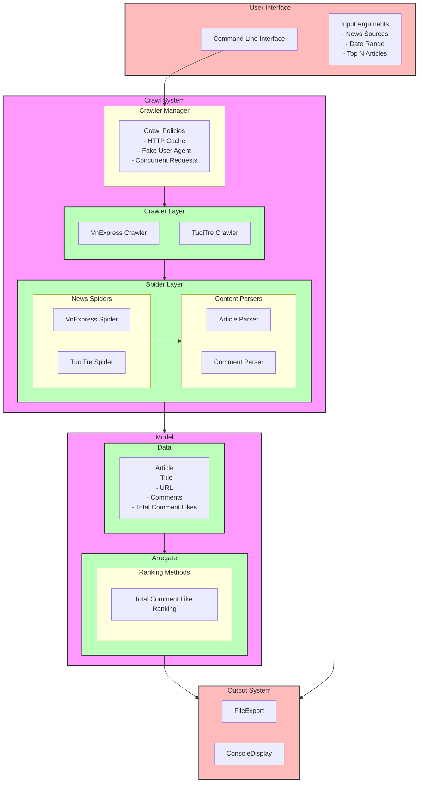

# Hot Articles Crawler Script

## Installation

1. Install dotnet
1. Build and run the project
    ```sh
    dotnet build
    dotnet run
    ```

## Usage

1. To run the spider, use the following command:
    ```sh
   # run last 7 days (default)
     dotnet run crawl 
   
   # run from start_date to end_date
     dotnet run crawl --type=tuoitre --start=2024-12-31 --end=2024-12-31  
    ```

## Project

- Mermaid Diagram - Supported by Claude

